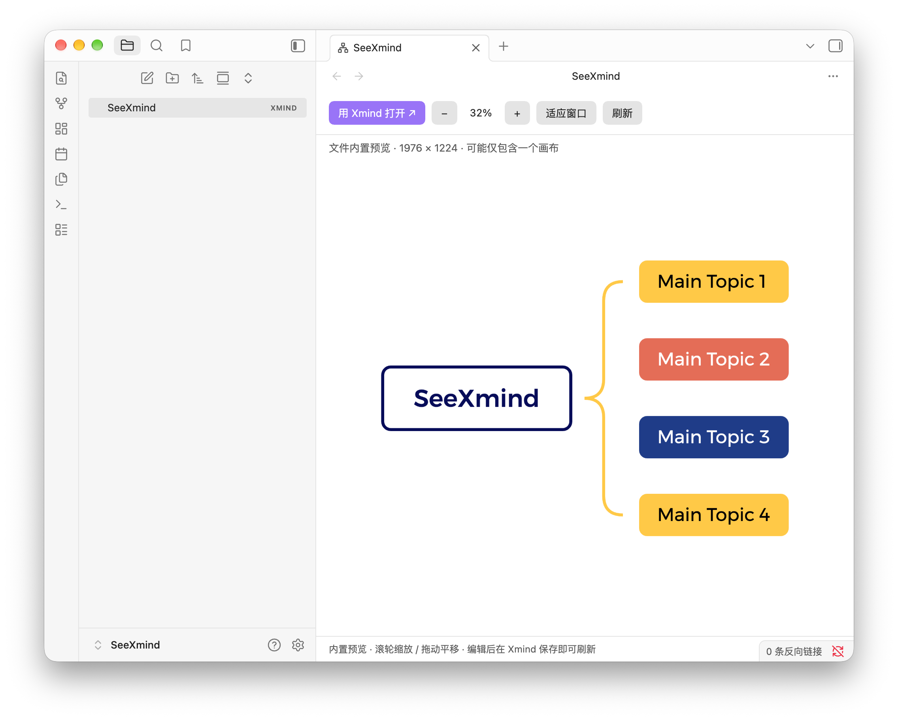
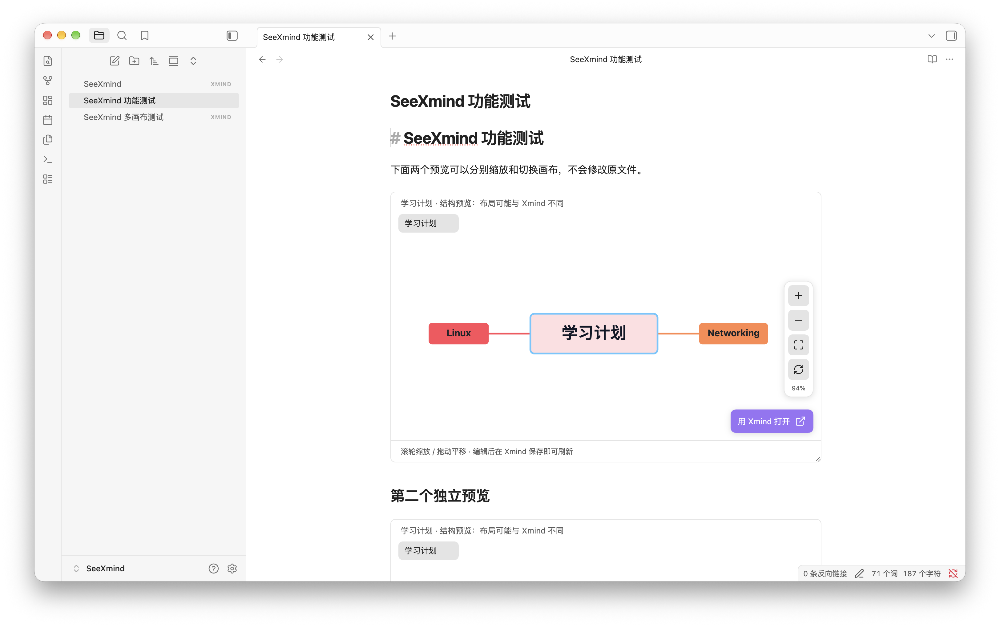
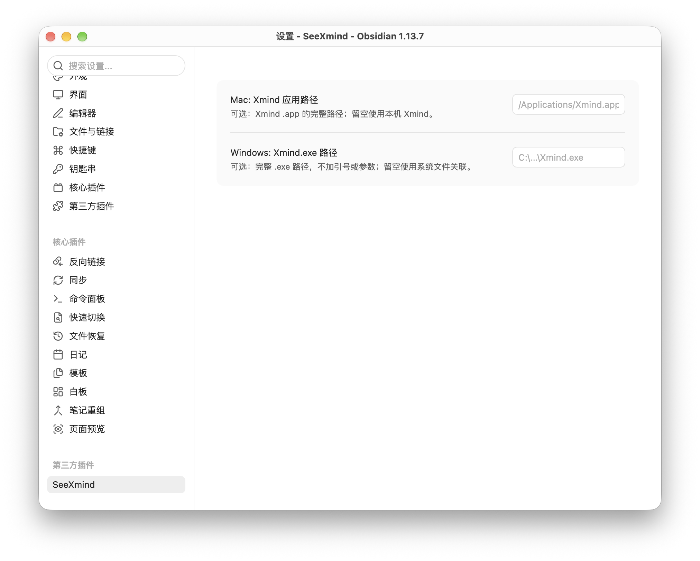

# SeeXmind

[简体中文](README.zh-CN.md) · [Download](https://github.com/leyem8919-coder/SeeXmind/releases/latest) · [Report an issue](https://github.com/leyem8919-coder/SeeXmind/issues)

Preview local `.xmind` files inside Obsidian, embed them in your notes, and open the original in the Xmind desktop app when you want to edit.

SeeXmind is an independent, unofficial plugin. It is not affiliated with, endorsed by, or sponsored by Xmind or Obsidian. Xmind remains the editor; SeeXmind does not include Xmind or unlock its paid features.

## Features

- Show `.xmind` files in the vault file explorer. Single-click to preview; double-click to open the original in Xmind.
- Embed interactive previews in Markdown with `![[Mind map.xmind]]`.
- Switch between sheets from the preview's sheet selector.
- Zoom, pan, fit, and refresh using the floating icon toolbar on the right. Hover over an icon to see its label.
- Open the original with the floating **Open in Xmind** button at the bottom-right.
- Set idle control opacity from **0% to 100%**. Hover or keyboard focus always reveals the controls.
- English and Simplified Chinese interface, following Obsidian's current language where available; other languages fall back to English.
- Optional macOS `.app` and Windows `.exe` paths.

## Screenshots

Screenshots supplied by the maintainer, showing the macOS interface in Simplified Chinese.

**Original image preview and floating controls**



**Interactive Markdown embeds**



**Custom application paths and idle opacity**



## Installation

Requires desktop Obsidian 1.8.7 or later. macOS and Windows are supported; mobile is not supported. We recommend installing [Xmind](https://xmind.app/) separately for editing. Previewing supported files does not require an Xmind account or a running Xmind app.

If SeeXmind is available in **Settings → Community plugins → Browse**, search for **SeeXmind**, install it, and enable it. If it is not listed, use manual installation:

1. Download `main.js`, `manifest.json`, and `styles.css` from the same [public release](https://github.com/leyem8919-coder/SeeXmind/releases/latest).
2. Put all three in `<your-vault>/.obsidian/plugins/seexmind/`.
3. Reload Obsidian, then enable SeeXmind in Community plugins.

There is no need to access or download the private source repository. When updating, replace the three installation files and preserve `data.json` if you want to keep your settings. Disable other plugins that claim the `.xmind` extension.

## Usage

Put an `.xmind` file inside your vault. Single-click it in the file explorer to open the preview. Double-click the explorer entry, use the preview's **Open in Xmind** button, or choose **Open in Xmind** from its file menu to edit externally. Save in Xmind, then return to Obsidian; SeeXmind refreshes when the vault reports a file change. The refresh icon also reloads the file.

### Embed in a note

```md
![[Mind map.xmind]]
```

A vault-relative path also works, for example `![[Maps/Study plan.xmind]]`. Use Reading view or Live Preview with the cursor outside the embed. Each embedded preview has its own sheet selection, zoom, and pan. Drag the bottom-right resize handle to change its height.

For versions or themes where the native embed hook is unavailable, use this code block:

````md
```xmind
Maps/Study plan.xmind
```
````

The native Live Preview integration uses a capability-checked Obsidian embedding hook. Reading view and the code-block renderer provide fallbacks; future Obsidian changes may require a plugin update.

### Choose a preview mode or sheet

- **Embedded image (original layout)** shows the PNG stored by Xmind inside the file, preserving that image's appearance. It may represent only one sheet, may be outdated until the file is saved again in Xmind, and has a fixed resolution.
- **Named sheets** are local structure previews reconstructed from `content.json` or supported `content.xml` data. You can inspect each sheet, but the layout, fonts, spacing, and advanced elements may differ from Xmind. Resource images and some advanced sheet features are not reconstructed.

SeeXmind never relabels one embedded image as another sheet. If exact appearance matters, use the embedded image or open the original in Xmind. Unsupported, encrypted, damaged, or overly complex files may not render. Archives above 128 MB are rejected; decompression and document complexity are also bounded.

### Controls and settings

- Right toolbar: **Zoom in**, **Zoom out**, **Fit to window**, **Refresh preview**.
- Scroll over the map to zoom, drag to pan. With the canvas focused, `+` / `-` zoom and `0` fits the map.
- **Floating controls idle opacity** applies immediately to open previews. At 0%, controls remain in their usual positions and appear on hover or keyboard focus.
- **Mac application path:** leave blank to use the installed Xmind, or enter a full path such as `/Applications/Xmind.app`.
- **Windows executable path:** leave blank to use the `.xmind` file association, or enter the full path to `Xmind.exe`. Do not add quotes or command-line arguments.
- After changing Obsidian's language, reopen the preview or reload the plugin to refresh existing interface labels.

## External application capability warning

The directory may show **“Shell Execution / child_process”**. SeeXmind uses Node.js process-launching APIs to open Xmind on macOS (including a custom `.app`) or a user-selected `.exe` on Windows. Windows with no custom path uses the system file association.

- Launching happens only after you double-click a file or choose an Open in Xmind button, command, or menu item. Loading the plugin and displaying previews do not launch the application.
- Local `.xmind` paths and custom application paths are validated. The executable and arguments are passed separately, without concatenated shell command strings or a shell interpreter.
- SeeXmind does not request administrator elevation. This warning describes a powerful API available to the plugin; it is not a request for administrator or Full Disk Access permission.
- This is **not a sandbox or a guarantee of safety**. The selected program runs with the current user's permissions and receives the file path. A malicious executable can cause harm: choose only a trusted local Xmind installation. File-extension checks do not verify the publisher or contents of that program.

We retain and disclose this capability to support custom application paths; we do not hide it or claim the warning has been eliminated. The plugin does not initiate network requests or collect telemetry; external applications have their own behavior. See [PRIVACY.md](PRIVACY.md).

## Privacy and scope

The plugin processes previews locally in memory and does not initiate network requests, load remote resources, upload documents, collect analytics, or run telemetry. It reads the selected vault file through Obsidian's API and saves application paths and opacity in local plugin settings. Opening Xmind is a user-triggered action that passes the selected local file path to the installed app.

Xmind, Obsidian, GitHub, and any vault synchronization or network storage services have their own network behavior and privacy policies. Obsidian plugins are not security-sandboxed. See [PRIVACY.md](PRIVACY.md).

**Upgrading from 0.2.2:** custom paths are restored in 0.2.3. If you saved settings in 0.2.2, those paths may have been removed; enter them again. Existing idle opacity is preserved.

## Compatibility and limitations

Version 0.2.0 was checked in macOS Obsidian 1.13.7 for standalone previews, floating controls, opacity, multi-sheet selection, and independent Markdown embeds in Live Preview and Reading view. Automated tests cover archive validation, sheet parsing, localization, settings, and macOS/Windows opening arguments. The maintainer also reported successful Windows desktop testing on 2026-10-05; exact Windows, Obsidian, and Xmind versions were not recorded.

SeeXmind is a viewer and launcher, not a mind-map editor. Saving, exporting, account features, and any paid Xmind functionality remain the responsibility of Xmind.

## Distribution and license

This public repository contains user documentation and installable distribution files. The development source, build configuration, and tests remain in a private repository for maintenance and authorized source review. Distributed `main.js` is readable JavaScript; keeping the development repository private does not conceal its runtime logic or override its license.

Licensed under [Apache-2.0](LICENSE). Selected structure parsing and rendering components are adapted from [yuanzhixiang/obsidian-xmind](https://github.com/yuanzhixiang/obsidian-xmind), with attribution and modification details in [THIRD_PARTY_NOTICES.md](THIRD_PARTY_NOTICES.md). No Xmind proprietary engine is included.

Provided as-is, subject to the license and applicable law. These scope statements do not exclude liabilities that cannot lawfully be excluded or guarantee freedom from infringement or legal risk.

## Support and thanks

Thank you for using SeeXmind, sharing feedback, and helping test it! If it makes your workflow a little easier, you are welcome to buy the maintainer a coffee using the QR code below. Your encouragement helps support continued maintenance.

**Support is completely voluntary. No payment is required to install or use any current feature, and donating does not unlock extra features.** The QR code is provided here on GitHub only; the plugin does not display payment prompts or process payments.


